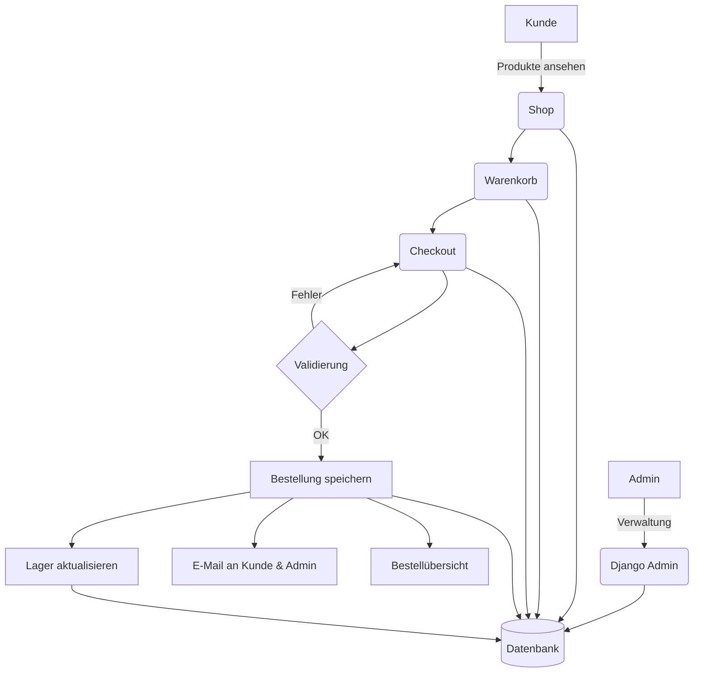

# Architekturübersicht

**Dieses Dokument gibt einen Überblick über die technische Architektur des Honigschätze E-Commerce-Systems für die Familienimkerei, die wichtigsten Komponenten, deren Zusammenspiel und besondere technische Lösungen.**

## Komponenten
- **Backend:** Django (Python), Model-View-Template (MVT)
- **Frontend:** HTML5, CSS3, JavaScript, Mobile-First Responsive Design
- **Templates:** Django Templates mit Blöcken
- **Internationalisierung:** Django ModelTranslation, Sprachumschaltung per URL
- **Datenbank:** SQLite für Familienbetrieb
- **E-Mail:** SMTP für Bestellbestätigungen
- **Zahlung:** Manuelle Zahlungsabwicklung (Überweisung, Barzahlung, PayPal)
- **Admin-Backend:** Django Admin für Familienbetrieb
- **Mobile-Optimierung:** Touch-optimierte Benutzeroberfläche, Responsive CSS, Performance-Optimierungen
- **Logging:** Benutzeraktivitäten und Geräte-Labels werden ausschließlich in der Datenbank gespeichert (keine Logdateien)

## Systemübersicht

## Besonderheiten
- Lagerverwaltung für Honig und Eimer
- Rabattlogik ab 7kg Honig
- E-Mail-Benachrichtigungen für Kunden und Familienbetrieb
- Mehrsprachigkeit (Deutsch vollständig, Ungarisch technisch vorbereitet)
- DSGVO-konforme Datenschutz- und Cookie-Hinweise
- Mobile-First Responsive Design für alle Bildschirmgrößen
- Touch-optimierte Benutzeroberfläche mit 44px Touch-Targets
- iOS-Zoom-Verhinderung und mobile Performance-Optimierungen
- Live-System unter https://honey-treasures.com
- **Benutzeraktivitäten und Geräte-Labels werden zur Sicherheit und Nachvollziehbarkeit ausschließlich in der Datenbank gespeichert**