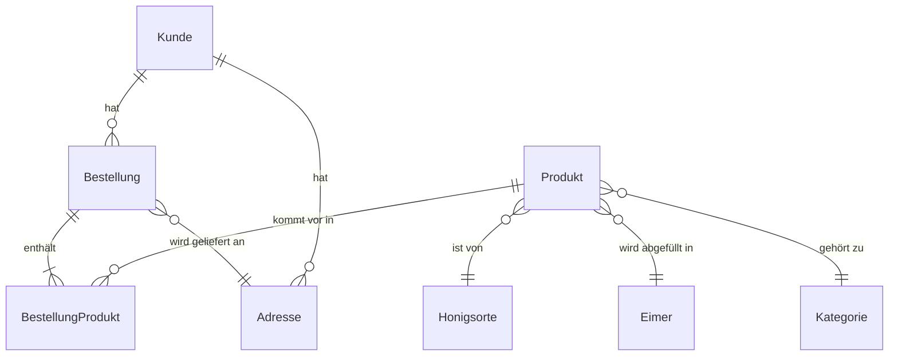

# Datenmodell

**Dieses Dokument erläutert die wichtigsten Datenmodelle, deren Beziehungen und Besonderheiten für das Honigschätze E-Commerce-System der Familienimkerei. Ein ER-Diagramm visualisiert die Zusammenhänge.**

## Hauptmodelle

- **Honigsorte**: Name, Preis pro 500g, Lagerbestand (kg)
- **Eimer**: Größe (kg), Lagerbestand
- **Produkt**: Name, Bild, Kategorie, Preis, Beschreibung, Verfügbarkeit, Honigsorte, Eimer
- **Kategorie**: Name, Beschreibung
- **Kunde**: Vorname, Nachname, E-Mail, Telefon, Benutzer (optional)
- **Bestellung**: Kunde, Adresse, Gesamtpreis, Zahlungsart, Versandart, Status, Produkte
- **BestellungProdukt**: Bestellung, Produkt, Menge, Einzelpreis
- **Adresse**: Straße, Hausnummer, PLZ, Stadt, Land, Kunde

## Beziehungen (ER-Diagramm)

## Besonderheiten
- Verfügbarkeit eines Produkts ergibt sich aus Honigbestand (Eimer-Mangel wird protokolliert, verhindert aber nicht die Bestellung)
- Rabattlogik ab 7kg Honig
- Bestellungen speichern IP-Adresse und Status
- Übersetzbare Felder für Produktnamen, Beschreibungen, Kategorienamen 